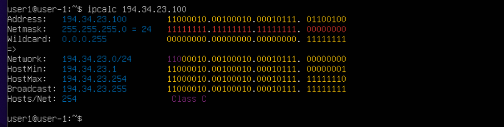
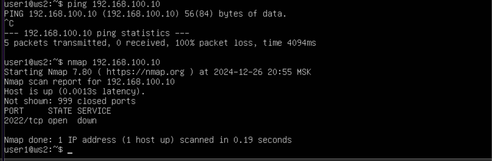
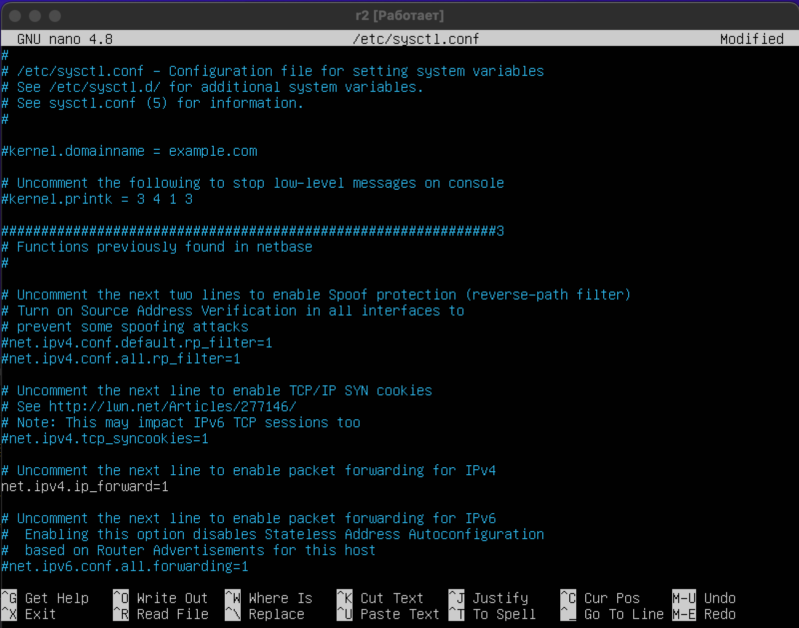
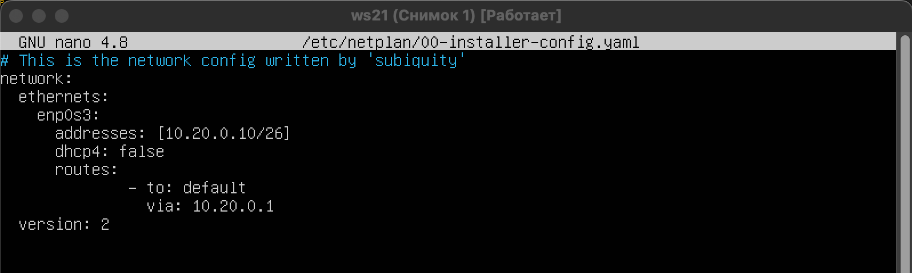
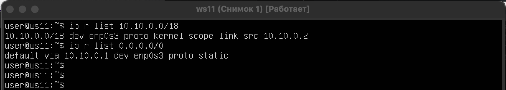

## Часть 1. Инструмент ipcalc

* сетевой адрес 192.167.38.54/13

<figure>
    
    <figcaption ></figcaption>
</figure> 

* Маска 255.255.255.0

	- в префиксной записи /24
	- в двоичной записи 11111111.11111111.11111111.00000000
	
<figure>
    
    <figcaption ></figcaption>
</figure>   
	
* Маска /15

	- маска 255.254.0.0
	- в двоичной записи 11111111.11111111.00000000.00000000
<figure>
    
    <figcaption ></figcaption>
</figure>

* Маска 11111111.11111111.11111111.11110000

	По таблице сетевых масок вычислил маску сети и префикс,
	так как ipcalc не поддерживает двоичную форму записи
	- маска 255.255.255.240
	- в префиксной записи /28

<figure>
    
    <figcaption ></figcaption>
</figure>

Проверяем, берем любой ip

<figure>
    
    <figcaption ></figcaption> 
</figure>

* ipcalc 12.167.38.4/8

	- минимальный хост 12.0.0.1
	- максимальный хост 12.255.255.254

<figure>
    
    <figcaption ></figcaption> 
</figure>

* 11111111.11111111.00000000.00000000 -> ipcalc 12.167.38.4/16

	- минимальный хост 12.167.0.1
	- максимальный хост 12.167.255.254

<figure>
    
    <figcaption ></figcaption> 
</figure>

* ipcalc 12.167.38.4/255.255.254.0

	- минимальный хост 12.167.38.1
	- максимальный хост 12.167.39.254 

<figure>
    
    <figcaption ></figcaption> 
</figure>

* ipcalc 12.167.38.4/4

	- минимальный хост 0.0.0.1
	- максимальный хост 12.255.255.254 

<figure>
    
    <figcaption ></figcaption> 
</figure>

* В самой последней строчке Hosts/Net пишется либо класс интернета, либо looopback, что значит айпи адрес внутренний
	
127.0.0.0 — 127.255.255.255 (зарезервировано для петлевых интерфейсов (не используется для обмена между узлами сети), т. н. localhost).

- 194.34.23.100 не является адресом локального 
	хоста, не входит в диапазон

<figure>
    
    <figcaption ></figcaption> 
</figure> 

- 127.0.0.2 является частью диапазона адресов localhost
	
<figure>
    
    <figcaption ></figcaption> 
</figure> 

- 127.1.0.1 является частью диапазона адресов localhost

<figure>
    
    <figcaption ></figcaption>  
</figure>

- 128.0.0.1 не является адресом локального хоста, не входит в диапазон

<figure>
    
    <figcaption ></figcaption> 
</figure> 

Итого к приложению localhost:
    - можно получить доступ по адресам 127.0.0.2, 127.1.0.1
    - нельзя получить доступ по адресам 194.34.23.100, 128.0.0.1 

Так же с помощью команды ipcalc мы можем посмотреть находится ли этот айпи адрес в списке частных или публичных сетей.

- 10.0.0.45 частный

<figure>
    
    <figcaption ></figcaption> 
</figure> 

- 134.43.0.2 публичный

<figure>
    
    <figcaption ></figcaption> 
</figure> 

- 192.168.4.2 частный

<figure>
    
    <figcaption ></figcaption> 
</figure> 

- 172.20.250.4 частный

<figure>
    
    <figcaption ></figcaption> 
</figure> 

- 172.0.2.1 публичный

<figure>
    
    <figcaption ></figcaption> 
</figure> 

- 192.172.0.1 публичный

<figure>
    
    <figcaption ></figcaption> 
</figure> 

- 172.68.0.2 публичный
 
<figure>
    
    <figcaption ></figcaption> 
</figure> 
  
- 172.16.255.255 частный

<figure>
    
    <figcaption ></figcaption> 
</figure> 

- 10.10.10.10 частный

<figure>
    
    <figcaption ></figcaption> 
</figure> 

- 192.169.168.1 публичный

<figure>
    
    <figcaption ></figcaption> 
</figure> 

* какие из перечисленных IP-адресов шлюза возможны для сети 10.10.0.0/18 : 10.0.0.1 , 10.10.0.2 , 10.10.10.10 , 10.10.100.1 , 10.10.1.255

 
<figure>
    
    <figcaption ></figcaption> 
</figure> 
	
	Диапазон IP адресов для сети 10.10.0.0/18 
	HostMin: 10.10.0.1
	HostMax: 10.10.63.254
	
	поэтому возможны для сети 10.10.0.0/18: 
	10.10.0.2
	10.10.10.10
	10.10.1.255

    не может имкеть ip:
    10.0.0.1
    10.10.100.1

## Часть 2. Статическая маршрутизация между двумя машинами

**ws1**

<figure>
    
    <figcaption ></figcaption> 
</figure> 

**ws2**
 
<figure>
    
    <figcaption ></figcaption> 
</figure> 

* Выполните netplan apply команду для перезапуска сетевой службы.

ws1

<figure>
    
    <figcaption ></figcaption> 
</figure> 

ws2 

<figure>
    
    <figcaption ></figcaption> 
</figure> 

1 Добавление статического маршрута вручную

* Добавьте статический маршрут от одной машины к другой. Проверьте соединение между машинами

ws1

<figure>
    
    <figcaption ></figcaption> 
</figure> 

ws2 

<figure>
    
    <figcaption ></figcaption> 
</figure> 

<figure>
    
    <figcaption ></figcaption> 
</figure> 

<figure>
    
    <figcaption ></figcaption> 
</figure> 

2 Добавление статического маршрута с сохранением

* Добавьте статический маршрут с одной машины на другую с помощью файла /etc/netplan/00-installer-config.yaml

<figure>
    
    <figcaption ></figcaption> 
</figure> 

* Проверьте соединение между машинами. 

<figure>
    
    <figcaption ></figcaption> 
</figure> 

## Часть 3. Утилита iperf3

1. Скорость соединения

* Конвертируйте и запишите результаты в отчет: 8 Мбит/с в МБ/с, 100 МБ/с в Кбит/с, 1 Гбит/с в Мбит/с

	- 8 Мбит/с - 1 МБ/c
	- 100 МБ/с - 800 000 Кбит/с
	- 1 Гбит/с - 1000 Мбит/с

2. утилита iperf3

* Измерьте скорость соединения между ws1 и ws2

ws1

<figure>
    
    <figcaption ></figcaption> 
</figure> 

ws2 

<figure>
    
    <figcaption ></figcaption> 
</figure> 
 

## Часть 4. Сетевой брандмауэр

<figure>
    
    <figcaption></figcaption> 
</figure>
   
<figure>
    
    <figcaption></figcaption> 
</figure>

<figure>
    
    <figcaption></figcaption> 
</figure>

Флаг -j в команде iptables используется для указания целевого действия, которое должно быть выполнено, если пакет соответствует заданным условиям в правиле. Так как на машине ws1 первым срабатывает правило DROP, то пакет отбрасывается и пинг от ws2 до ws1 не будет работать. Разрешающее правило, которое идет следующим уже не срабатывает. На ws2 первым действием срабатывает ACCEPT, пакет принимается и пинг работает.
	
2. Утилита nmap

* Используйте команду ping , чтобы найти машину, которая не пингуется, затем используйте утилиту nmap, чтобы показать, что хост машины работает

<figure>
    
    <figcaption></figcaption> 
</figure> 

<figure>
    
    <figcaption></figcaption> 
</figure> 

* Разница между стратегиями, применёнными в первом и втором файлах (/etc/firewall.sh на ws1 и ws2), заключается в порядке написания правил и их эффекте на работу файрвола.

    Стратегия на ws1 Сначала применяется запрещающее правило для ICMP (пинг). Затем добавляется разрешающее правило, которое перезаписывает предыдущее, чтобы разрешить ICMP.
    В данном случае запрещающее правило становится неэффективным, поскольку разрешающее правило, добавленное после него, перекрывает действие запрета. Итоговое поведение машины: ICMP разрешён (пинг работает).

    Стратегия на ws2 Сначала применяется разрешающее правило для ICMP (пинг). Затем добавляется запрещающее правило, которое перезаписывает предыдущее, чтобы заблокировать ICMP.
    В данном случае разрешающее правило становится неэффективным, поскольку запрещающее правило, добавленное после него, перекрывает действие разрешения. Итоговое поведение машины: ICMP запрещён (пинг не работает).

    Флаг -j (действие): Этот флаг определяет, что делать с пакетом, если он подходит под условия правила. Именно последовательная проверка и раннее применение действия на первом совпадающем правиле определяют итоговое поведение. В правилах iptables важно учитывать порядок, особенно если используются как разрешающие (ACCEPT), так и запрещающие (DROP) действия. Обычно сначала задаются общие правила (например, разрешение базовых соединений), а затем блокируются более специфичные или оставшиеся соединения.

## Часть 5. Статическая сетевая маршрутизация

* Настройка адресов машин
* скрины с содержанием файла etc/netplan/00-installer-config.yaml для каждой машины

<figure>
    
    <figcaption>ws11</figcaption> 
</figure> 

<figure>
    
    <figcaption>ws21</figcaption> 
</figure> 

<figure>
    
    <figcaption>ws22</figcaption> 
</figure> 

<figure>
    
    <figcaption>r1</figcaption> 
</figure> 

<figure>
    
    <figcaption>r2</figcaption> 
</figure> 

* вызов команд netplan apply, ip -4 a проверить, что адрес машины задан верно.

<figure>
    
    <figcaption>ws11</figcaption> 
</figure> 

<figure>
    
    <figcaption>ws21</figcaption> 
</figure> 

<figure>
    
    <figcaption>ws22</figcaption> 
</figure> 

<figure>
    
    <figcaption>r1</figcaption> 
</figure> 

<figure>
    
    <figcaption>r2</figcaption> 
</figure> 

<figure>
    
    <figcaption>пинг ws22 с ws21</figcaption> 
</figure> 

<figure>
    
    <figcaption>пинг r1 с ws11</figcaption> 
</figure> 

* Включение переадресации IP-адресов

<figure>
    
    <figcaption>r1 вызов команды sysctl -w net.ipv4.ip_forward=1</figcaption> 
</figure> 

<figure>
    
    <figcaption>r2 вызов команды sysctl -w net.ipv4.ip_forward=1</figcaption> 
</figure> 

<figure>
    
    <figcaption> r1 добавил строку net.ipv4.ip_forward = 1 </figcaption> 
</figure> 

<figure>
    
    <figcaption>r2 добавил строку net.ipv4.ip_forward = 1</figcaption> 
</figure> 

* Установка маршрута по умолчанию

<figure>
    
    <figcaption>ws11 netplan</figcaption> 
</figure> 
<figure>
    
    <figcaption>ws21 netplan</figcaption> 
</figure> 
<figure>
    
    <figcaption>ws22 netplan</figcaption> 
</figure> 

<figure>
    
    <figcaption>ws11 ip r</figcaption> 
</figure> 
<figure>
    
    <figcaption>ws21 ip r</figcaption> 
</figure> 
<figure>
    
    <figcaption>ws22 ip r</figcaption> 
</figure> 

Пропингуй с ws11 роутер r2 и покажи на r2, что пинг доходит. Для этого используй команду: tcpdump -tn -i eth0

<figure>
    
    <figcaption>ws11 ping 10.100.0.12</figcaption> 
</figure> 
<figure>
    
    <figcaption>r2 sudo tcpdump -tn -i enp0s8</figcaption> 
</figure> 

<figure>
    
    <figcaption>r1 статический маршрут</figcaption> 
</figure> 
<figure>
    
    <figcaption>r2 статический маршрут</figcaption> 
</figure> 

<figure>
    
    <figcaption>r1 ip r</figcaption> 
</figure> 
<figure>
    
    <figcaption>r2 ip r</figcaption> 
</figure> 

<figure>
    
    <figcaption>ip r list 10.10.0.0/18 и ip r list 0.0.0.0/0</figcaption> 
</figure> 

Для сети 10.10.0.0/18 предпочтение было отдано специфичному маршруту, а не маршруту по умолчанию (0.0.0.0/0), так как в маршрутизации действует принцип «наиболее длинного совпадения префикса» (longest prefix match). Это правило гарантирует выбор более точного пути: маршрут с более детальной маской (большей длиной префикса) всегда приоритетен. Таким образом, маршрут по умолчанию активируется только при отсутствии альтернатив, так как его префикс 0.0.0.0/0 является наименее специфичным.

* Построение списка маршрутизаторов

<figure>
    
    <figcaption>ws11</figcaption> 
</figure> 
<figure>
    
    <figcaption>r1</figcaption> 
</figure> 

<figure>
    
    <figcaption>ws11</figcaption> 
</figure> 
<figure>
    
    <figcaption>r1</figcaption> 
</figure> 

## Часть 6. Динамическая настройка IP с использованием DHCP

* Для r2 настрой в файле /etc/dhcp/dhcpd.conf конфигурацию службы DHCP:

<figure>
    
    <figcaption>/etc/dhcp/dhcpd.conf</figcaption> 
</figure> 
<figure>
    
    <figcaption>/etc/resolv.conf</figcaption> 
</figure> 
<figure>
    
    <figcaption>ip a</figcaption> 
</figure> 
<figure>
    
    <figcaption>ping 10.20.0.10</figcaption> 
</figure> 
<figure>
    
    <figcaption>/etc/netplan/00-installer-config.yaml</figcaption> 
</figure> 

<figure>
    
    <figcaption>r1 /etc/dhcp/dhcpd.conf</figcaption> 
</figure> 

<figure>
    
    <figcaption>WS11 ip a после перезагрузки</figcaption> 
</figure> 

<figure>
    
    <figcaption>ws21 до смены ip</figcaption> 
</figure> 
<figure>
    
    <figcaption>обновление ip</figcaption> 
</figure> 
<figure>
    
    <figcaption>ws21 после обновления ip</figcaption> 
</figure> 

## Часть 7. НАТ

* В файле /etc/apache2/ports.conf измените строку Listen 80на Listen 0.0.0.0:80on ws22 и r1, т.е. сделайте сервер Apache2 публичным

<figure>
    
    <figcaption>ws22</figcaption> 
</figure> 
<figure>
    
    <figcaption>r1</figcaption> 
</figure> 

* Запустите веб-сервер Apache с помощью service apache2 startкоманды на ws22 и r1

<figure>
    
    <figcaption>ws22</figcaption> 
</figure> 
<figure>
    
    <figcaption>r1</figcaption> 
</figure> 

<figure>
    
    <figcaption>Пинг с ws22 до r1 не удаётся</figcaption> 
</figure> 
<figure>
    
    <figcaption>Пинг с ws22 до r1 удаётся</figcaption> 
</figure> 